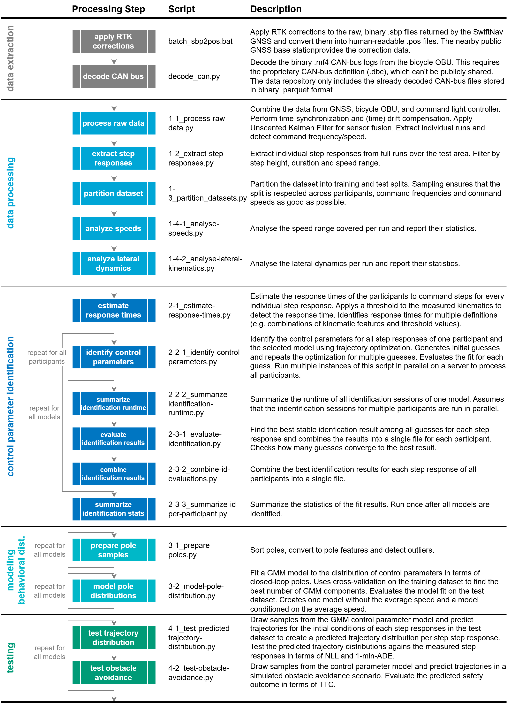

# Stochastic Control Behavior of the Balancing Rider for Cycling Safety in Traffic Simulation

This repository contains the **research code** corresponding to the publication *Stochastic Control Behavior of the Balancing Rider for Cycling Safety in Traffic Simulation* submitted to Transporation Research Part C: Emerging Technologies. It contains scripts and a modular Python package for:

- processing of raw data from our cycling experiment.

- identifying rider control parameters from heading step responses.

- modeling the distributions of rider control parameters 

- testing the predictive power of our stochstic Balancing Rider model

Raw data, processed data and results can be found in the corresponding **data repository** hosted on 4TU Research Data, DOI: [10.4121/f881dd80-b9f5-4322-9fd5-192034c9717f](https://doi.org/10.4121/f881dd80-b9f5-4322-9fd5-192034c9717f)

### Disclaimer

The repository contains research code not ready for production. Next to the active codebase, it contains several remenants of stale / discontinued research paths that may not function correctly. A proper API documentation is missing. Refer to the analysis scripts in `/scrips/` for examples how to use the code and the docstrings where available. 

## Installation

1. Clone this repository.

2. Create a virtual environment including the base dependencies specified in `/environment.base.yml`.
   
   ```shell
   conda env create -f environment.base.yaml
   conda activate rcid
   ```

3. Install custom dependencies. This repository depends on a few custom packages that are not available on PyPi or conda-forge. Navigate to their public repositories on GitHub and follow installation instructions there to install them manually. Make sure to install the correct version specified in the `/packages/rcid/pyproject.toml`.
   
   - `mypyutils` [GitHub](https://github.com/chris-konrad/mypyutils)
   
   - `pypaperutils` [GitHub](https://github.com/chris-konrad/pypaperutils)
   
   - `pytrafficutils` [GitHub](https://github.com/chris-konrad/pytrafficutils)
   
   - `trajdatamanager` [GitHub](https://github.com/chris-konrad/trajdatamanager)
   
   - `cyclistsocialforce` [GitHub](https://github.com/chris-konrad/cyclistsocialforce)

4. Install the `rcid` (Rider Control IDentification) package by navigating to its directory (`/packages/rcid`) and calling. Add `-e` for an editable install.
   
   ```shell
   pip install . 
   ```

## Usage

Find instructions how to reuse the trained models or how to run the full analysis presented in our study below.

### Reusing the Models

> [!NOTE]
> 
> We intend to fully merge the calibrated and tested models into our cyclist traffic simulation framework [chris-konrad/cyclistsocialforce](https://github.com/chris-konrad/cyclistsocialforce) for more convenient application. When this is finished, this repository will remain active as a reference for the paper and for calibrating/testing the models.

To reuse the models generated in the present thesis, the following steps have to be executed.

- create a PoleModel object from existing parameters.

- sample poles (aka the behavioral parameters) form the pole model

- create a Vehicle object with the desired bicycle model and pass the poles

- integrate the dynamics by calling the vehicles' step-function. 

`examples/mwe_using-models.ipynb` provides an extensively commeted minimum working example for reusing our models.

#### Model Types

This repository contains two model variants. See the corresponding publication for details.

- **Balancing Rider (`BR0`, `BR1`):** A mechanical model of the upright bicycle with full-state feedback control to emulate the rider's control effort. `BR1` represents a reduced variant of the full-state feedback with the steer rate gain set to 0. Consult the paper for detailed insights into which model to use. For normal riding, we recommend to start with the more robust `BR1`.

- **Planar Point (`PP0`)**: A planar moving point tracking the commanded heading representing bicycle and rider. Used for benchmarking and not recommended in any application scenarios.

Both models are combined with a stochastic behavioral model of the control parameters (i.e., the closed loop poles) represented by a multivariate Gaussian Mixture. For each bicycle model, a speed-dependend and a speed-independend model can be used. The pole model variants are called `ImRe5` / `ImRe5GivenV` for the Balancing Rider models and `Re1`/`ImRe1GivenV` for the Planar Point models.

All trained parameter files are archived in the [data repository](https://doi.org/10.4121/f881dd80-b9f5-4322-9fd5-192034c9717f). For convenience, this repository includes copies of the three models in `/assets/pole_models`.

### Running the Analysis

Running the full analysis pipeline requires executing the Python scripts in `/scripts/` in consecutive order. The instructions below show how to rerun the full analyis of our publication on the corresponding data. Running the analysis on your own data may require adapting data processing for compatibility. 

#### Acquiring Data

To run the analysis on the original data, visit the [data repository](https://doi.org/10.4121/f881dd80-b9f5-4322-9fd5-192034c9717f), download the data, and save it into a directory of your choice. 

To create your own data, consult the paper and/or the [data repository](https://doi.org/10.4121/f881dd80-b9f5-4322-9fd5-192034c9717f) for detailed information on the experimental setup.

#### Analysis Configuration

The analysis pipeline includes a large number of configurable parameters. The parameters used for generating the results of the publication are defined in `/scripts/config.yaml`. To run the analysis on your system, set the `dir_data` and `dir_results` variables to the directory containing the downloaded data (i.e. the directory containing `/raw/...` and/or `/processed/...`) and the desired output directory for results. Then, pass the config file to each script in the processing pipeline using the `--config` option.

#### Processing pipeline

The figure below explains all steps of the pipeline. Some scripts need to be executed multiple times to process all participants and models. In these cases, the bicycle model, behavioral model, and/or participant need to be specified using the `--model`, `--polemodel`, and/or `--part` options. The pipeline can be separated in the following sections:

- **Data Extraction:** These steps extract the raw data from proprietary / encoded file types and applies RTK-GNSS corrections. The referenced scripts life in the repositories [chris-konrad/swiftnav_processing](https://github.com/chris-konrad/swiftnav_processing) and [chris-konrad/sensorbike](https://github.com/chris-konrad/sensorbike). The  RTK-Lib configuration file can be found in the data repository. The data repo contains RTK-corrected GNSS files and decoded CAN logs for convenience, making the execution of these two steps unnecessary.

- **Data Processing:** These steps fuse and filter the raw data from several sensors, creating individual data tables for each run across the experimental area. It identifies individual step responses in the data and creates data tables for each step response. 

- **Rider Control Identification:** These steps identify the rider control parameters for each step response. The identification script needs to be executed once for each participant and each model. 

- **Modeling Behavioral Distributions:** These steps fit stochastic models to the identified behavioral parameters. Each script needs to be executed once per model.

- **Testing:** These scripts test the predicted trajectory distribution and the model performance in an obstacle avoidance scenario.



### Authors

- Christoph M. Konrad (formerly Schmidt), c.m.konrad@tudelft.nl

### License

This software is licensed under the terms of the [MIT License](LICENSE).

The pole model parameters under `/assets/pole_models/` are a copy of the parameters published in the data [data repository](https://doi.org/10.4121/f881dd80-b9f5-4322-9fd5-192034c9717f), licensced CC-BY.

## Citation

If you use this software in your research, please cite our corresponding publication:

Konrad, C. M., Happee, R., Moore, J. K., & Dabiri, A. (2025). *Stochastic Control Behavior of the Balancing Rider for Cycling Safety in Traffic Simulation* [Manuscript].
